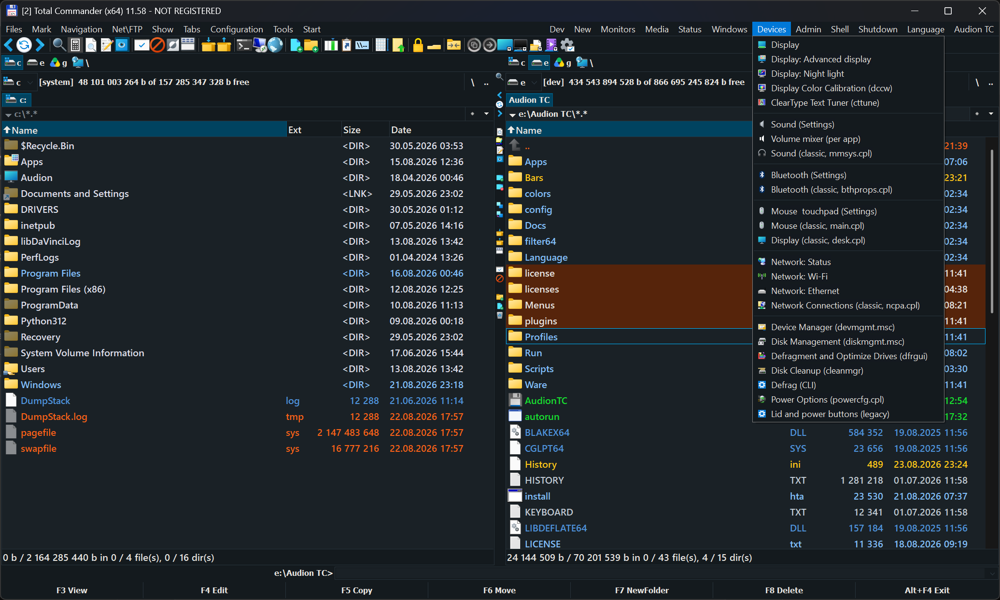

# Audion TC — portable Total Commander

<!-- audion:release -->
   

**Version 2.2.0** · 2026-08-25 · 112.0 MB

- [Direct download](https://audion.dev/get/tc-portable/2.2.0/Audion_TC_Portable_v2.2.0_Full.zip) — unmetered, no rate limits
- [Project page](https://audion.dev/downloads/tc-portable) — every version and how to install

`SHA-256: 0a8ab468cf396c55e8628dacf99a9577c1e02072681c8df3b952abce5b0a22f6`

---

An **Audion** tool, published by [Tensionix](https://github.com/Tensionix).
<!-- /audion:release -->

Release 2.2.0

Inside is the folder "Audion TC". Copy it anywhere — a flash drive will do — and run it from there. Nothing is written to the system, and removing the folder removes the program.

The interface starts in English. Russian is one click away: menu Language.

## First run — three things worth doing

### 1. Language

Top menu bar, "Language" → English or Russian. Total Commander closes and reopens by itself; the choice is remembered.

### 2. The required plugins

Menu "Audion TC" → "Install the required plugins".

Four plugins cannot be shipped with the build: their authors marked them as non-redistributable. Without them Lister will not show SVG images, PDF and e-book files, or icons inside EXE and DLL files.

One click downloads them from the official Total Commander plugin catalogue and registers them. Pressing it twice is safe — what is already in place is left alone.

### 3. Notepad++ (only if you want it)

Menu "Audion TC" → "Install Notepad++ (GPL, separately)".

Notepad++ is published under the GPL, so it is fetched separately rather than bundled.

### 4. TeraCopy — copying with checksum verification

Menu "Audion TC" → "Install TeraCopy (freeware, separately)".

Not just another file copier: it hashes every file at the source and at the destination and compares the two. On a failing drive, on an unstable or overclocked system a plain copy corrupts a file silently — you find out a month later, when the archive will not open. TeraCopy tells you at once and names the file that did not match. For moving large archives and collections this is the whole point of it.

TeraCopy is freeware for private and educational use, so it is fetched separately — you accept its terms yourself.

## Where things are

Everything about the build lives in one menu: "Audion TC", the last section of the menu bar.

| Section | Entries |
| --- | --- |
| Applications | "Install applications — Audion (~2 GB)" — the author's set "Install applications — Ultimate (~8 GB)" — everything "Pick and install applications..." — by checkbox "Install an application..." — one at a time |
| VS Code Portable | "VS Code Portable: install with extensions". This is the only place it is installed from. |
| Themes | "Theme" → five palettes, dark and light. |
| Housekeeping | "Update all applications", "Clear the Apps folder", "Remove *.bak folders of previous versions", "Rebuild the menu after removing programs". |

Out of the box the build carries text editors, the system tools and seven Total Commander plugins. Everything else is downloaded on demand, so the archive stays small.

## If the Apps folder is empty

Menu entries for programs that are not installed disappear by themselves — the menu is rebuilt from what is actually on disk. "Open in Windows Notepad" stays in the Media menu in any case: it uses the system Notepad, which is always there.

## Licences

`licenses\` holds the full list of third-party components, their licences and the notices required by them. Audion TC itself is published under the Apache License 2.0 — see `LICENSE.txt` and `NOTICE.txt` inside the program folder.
